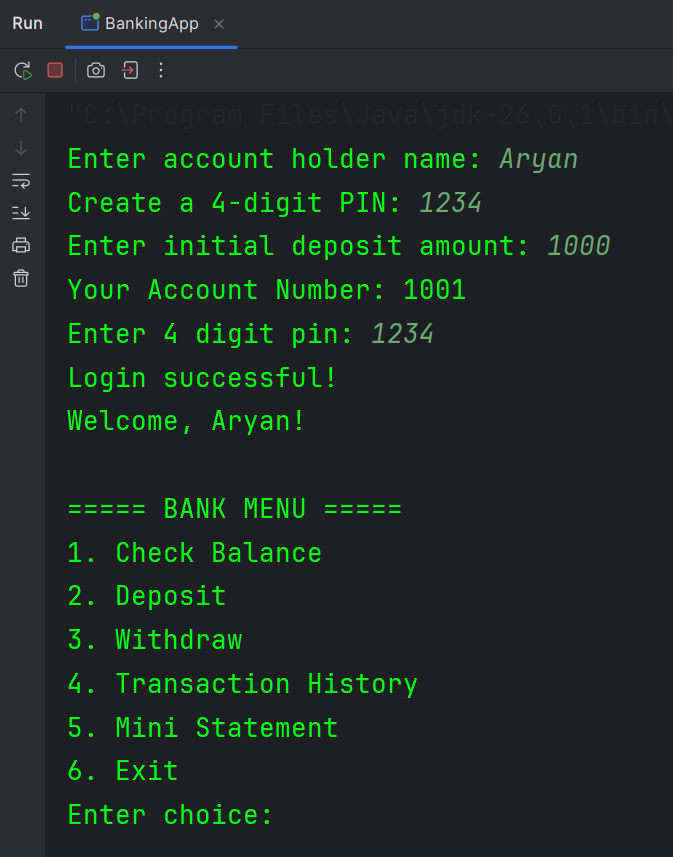
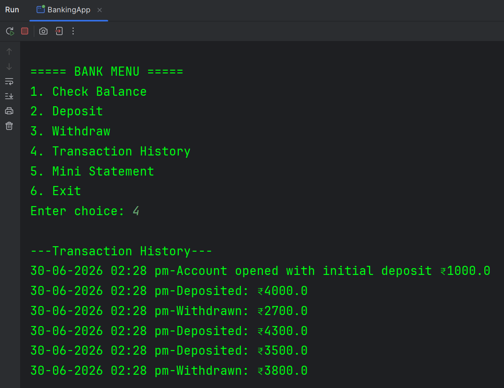
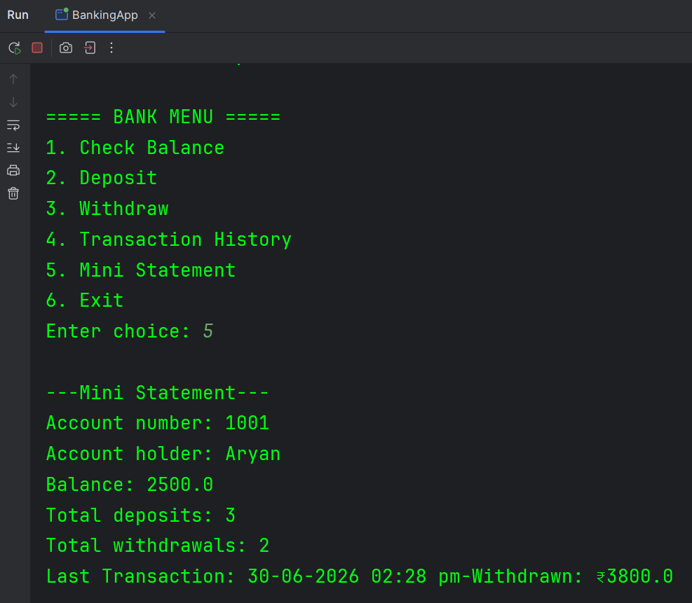

# 🏦 Simple Banking System (Java)

A console-based banking application built using **Core Java** that simulates basic banking operations through a menu-driven interface.

---

## ✨ Features

- 🔐 PIN Authentication (3 login attempts)
- 💰 Check Account Balance
- ➕ Deposit Money
- ➖ Withdraw Money
- 📜 Transaction History
- 📄 Mini Statement
- 📊 Deposit & Withdrawal Counters
- 🕒 Last Transaction Tracking
- 🔒 Account Lock after 3 incorrect PIN attempts
- 📋 Menu-driven User Interface

---

## 📸 Screenshots

<table>
<tr>
<td align="center">
<b>Login & Main Menu</b><br><br>

</td>

<td align="center">
<b>Transaction History</b><br><br>

</td>
</tr>

<tr>
<td colspan="2" align="center">
<b>Mini Statement</b><br><br>

</td>
</tr>
</table>

---

## 🛠️ Technologies Used

- Java
- Object-Oriented Programming (OOP)
- IntelliJ IDEA
- Git
- GitHub

---

## 📂 Project Structure

```
simple-banking-system
│
├── screenshots/
│   ├── login-menu.png
│   ├── transaction-history.png
│   └── mini-statement.png
│
├── src/
│   ├── BankAccount.java
│   ├── BankingApp.java
│   └── TransactionManager.java
│
└── README.md
```

---

## 🚀 How to Run

1. Clone the repository

```bash
git clone https://github.com/poojaryaryan/simple-banking-system.git
```

2. Open the project in **IntelliJ IDEA**

3. Run:

```
BankingApp.java
```

4. Enter the PIN and use the menu to perform banking operations.

---

## 📚 Concepts Used

- Object-Oriented Programming
- Classes & Objects
- Encapsulation
- User Input Handling
- Collections (if applicable)
- Menu-driven Application Design
- Java Fundamentals

---

## 👨‍💻 Author

**Aryan Poojary**

GitHub: https://github.com/poojaryaryan
